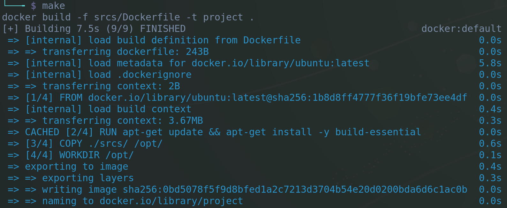
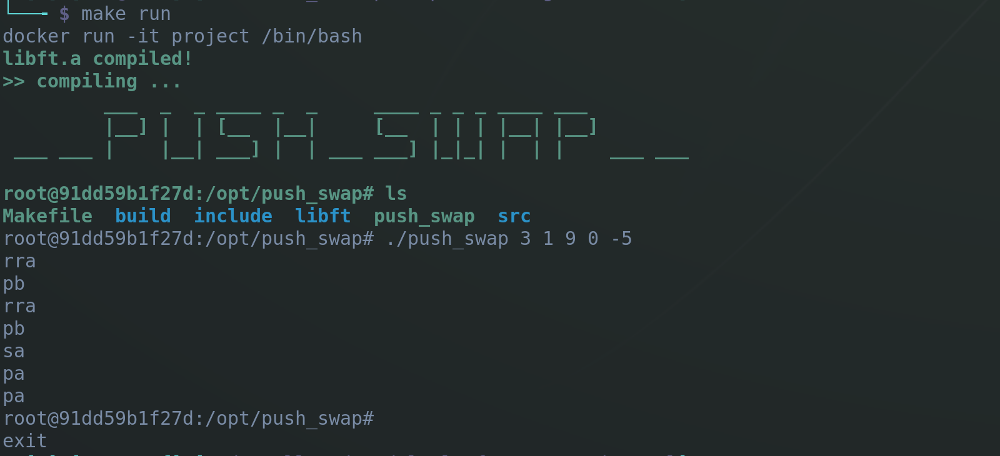

# PlatForge

## Current status
-- Completed --

## Description

* This is a simple Docker project which makes possible to run any of my
projects on any platform. Docker engine (Desktop) is necessary to build
Docker images and run them as containers.

* It can also be used for any C and C++ based projects which runs on
Debian / Ubuntu. In case of additional missing dependencies, those can
be easily included into Dockerfile and modifying the setup.sh script
accordingly.

* This tool was developed primarily for use with terminal (bash shell).

## Installation

- First copy a desired project into ```/srcs/``` directory

- To build a docker image run
```bash
make
```

## Usage

- Run docker container with
```bash
make run
```

- To debug a docker container
```bash
make debug
```

- To stop and remove all docker images / containers
```bash
make clean
```

- To exit a running container press ```Ctrl - D``` or run ```exit```.

## Examples

Building a docker image
<br>


Running a C project as a Docker container with interactive prompt
<br>

